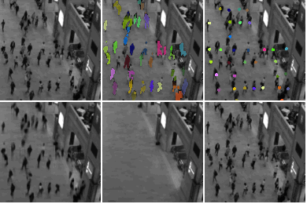
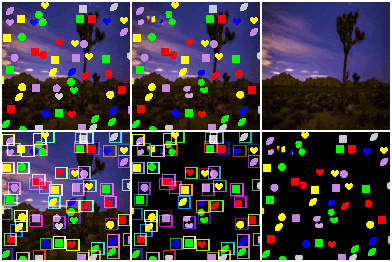

# Jindong Jiang

## About me

I am currently a MS student in ECE department of Rutgers University. And I am work with [Prof. Sungjin Ahn](http://www.sungjinahn.com) on the topic of Probabilistic Generative Models.

## Publication(s)

Names with "\*" indicates equal contribution or equal advising

Scalable Object-Oriented Sequential Generative Models \[[Arxiv](https://arxiv.org/abs/1910.02384)\] \[[Project](https://sites.google.com/view/scalor)\]

**J. Jiang**\*, S. Janghorbani\*, G. Melo, and S. Ahn

 

